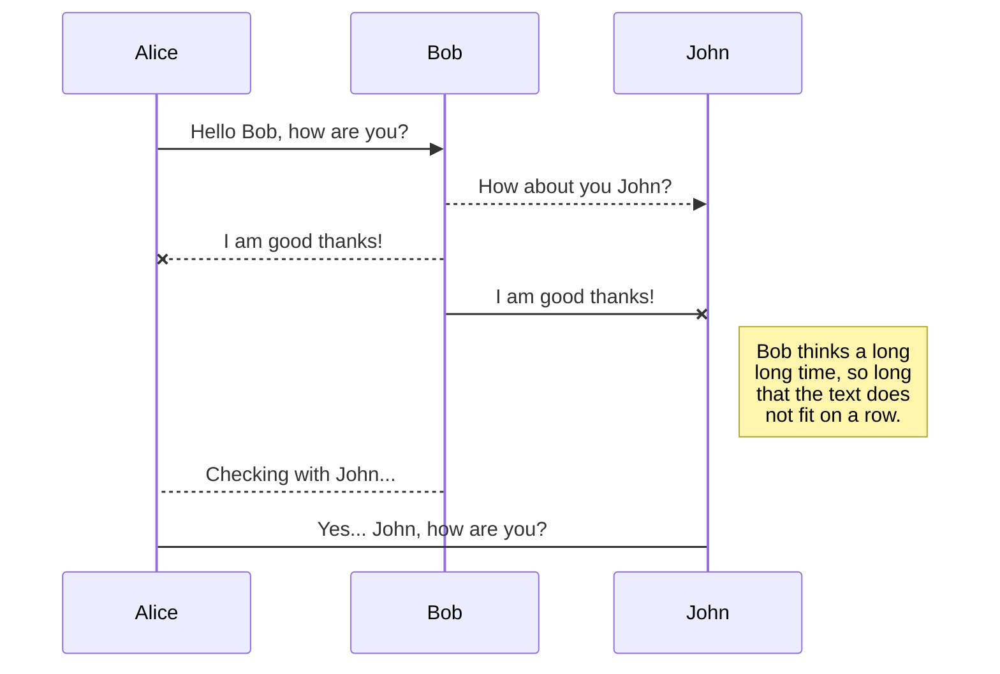
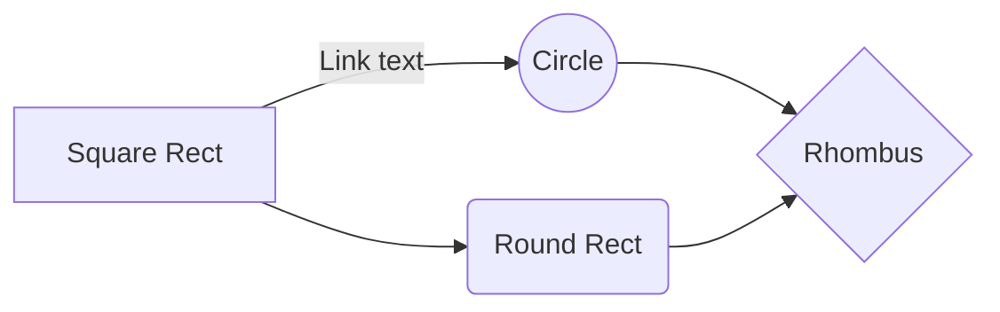

# Markdown Standard

## Headers

All 6 levels of headers

# Title
## Title 2
### Title 3
#### Title 4
##### Title 5
###### Title 6

## Lists

- a
- b
- c

1. c1
2. c2
3. c3

 - [ ] r1
 - [ ] r2
 - [ ] r3

## Format

**bold**, _intalic_, ~~Strikethrogh~~

> Note: .......

This is an `one line code`

This is an multiline code
```python
from main import main, md_to_html

# test
main('https://it.wikipedia.org/wiki/Pagina_principale')
main('../source/Il Fatto Quotidiano_HOME_20260928.htm')
main('../README.md')
```

## Link
[Go to Markdown Standard](#markdown-standard)  
[Wikipedia](https://it.wikipedia.org/wiki/Pagina_principale)


# Markdown Extensions

## SmartyPants

SmartyPants converts ASCII punctuation characters into "smart" typographic punctuation HTML entities. For example:

|                |ASCII                          |HTML                         |
|----------------|-------------------------------|-----------------------------|
|Single backticks|`'Isn't this fun?'`            |'Isn't this fun?'            |
|Quotes          |`"Isn't this fun?"`            |"Isn't this fun?"            |
|Dashes          |`-- is en-dash, --- is em-dash`|-- is en-dash, --- is em-dash|


## KaTeX

You can render LaTeX mathematical expressions using [KaTeX](https://khan.github.io/KaTeX/):

The *Gamma function* satisfying $\Gamma(n) = (n-1)!\quad\forall n\in\mathbb N$ is via the Euler integral

$$
\Gamma(z) = \int_0^\infty t^{z-1}e^{-t}dt\,.
$$

> You can find more information about **LaTeX** mathematical expressions [here](http://meta.math.stackexchange.com/questions/5020/mathjax-basic-tutorial-and-quick-reference).


## UML diagrams

You can render UML diagrams using [Mermaid](https://mermaidjs.github.io/). For example, this will produce a sequence diagram:



And this will produce a flow chart:

